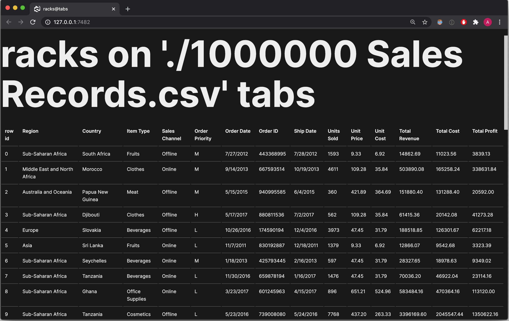

# racks-on-tabs

> (What you got?) Racks on tabs on tabs
>
> (He got) Racks on tabs on tabs
>
> (We got) Racks on tabs on taaabs
>
> ~[YC & Future, circa 2011, probably](https://www.youtube.com/watch?v=r5w21_Vphbg&ab_channel=ycvevo)

Command line app for browsing CSV files with row lazy loading.


*This is what opening 1M rows under 100ms looks like.*

```sh
$ racks-on-tabs <PATH_TO_CSV>
```

Starts a local webserver that serves the app content, accessible at [localhost:7482](http://localhost:7482).

# Installation

Requires Python 3. Tested with Python 3.8.

## pipx

_racks-on-tabs_ is a Python app with a set of dependencies.
The recommended way to install it is via [pipx](https://github.com/pipxproject/pipx):

```sh
$ pipx install racks-on-tabs
$ racks-on-tabs <PATH_TO_CSV>
```

## virtualenv

Alternatively, you can set up a local virtual env and install _racks-on-tabs_ there:

```sh
$ python3 -m venv venv
$ source venv/bin/activate
$ pip3 install racks-on-tabs
$ racks-on-tabs <PATH_TO_CSV>
```

## Troubleshooting

If for some reason you get "executable not found" errors, try locating the library installation path, and run:

```sh
$ python -m path/to/pip/packages/racks_on_tabs.__main__ <PATH_TO_CSV>
```

